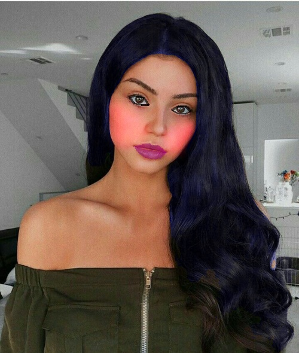

# Virtual-Makeup

This project aims to do virtual makeup on the face of a person using dib and keras libraries to detect the face mark, OpenCV and PIL libraries are used to for computer vision and image processing in this code.


### Follow the steps to implement the program :


* Install all required dependencies:
```bash

$ pip install dlib
$ pip install opencv-python
$ pip install numpy
$ pip install imutils
$ pip install tensorflow
$ pip install matplotlib

```

* Clone the Virtual-Makeup Repository on your System by using the below command
```bash
$ git clone https://github.com/xyfer17/Virtual-Makeup.git
```
* After these [Click Here](https://drive.google.com/drive/folders/1a6g9XcUkDPJDltuYEMb_lNOtnd4XUpQH?usp=sharing) and download  both the model files named `hairnet_matting_30.hdf5` and `shape_predictor_68_face_landmarks.dat` from the drive.

* After these copy the model files and paste inside the folder named `models` in the cloned Virtual-Makeup Reposistory that you cloned previously.

```bash
$ python demo.py -i [ image path]  -c [ hair color code R G B format]

$ python demo.py -i "assets/5.jpg"  -c 0  0  255

```
### Input :


### Output :




